# RPG 插件架构维护指南

修改 Agentic RPG 行为前先使用本 skill。它的目标不是写历史报告，而是让后续修改能快速确认：当前走哪条链路、哪个配置会改变流程、工具在哪里落盘、角色卡和 Director 在哪里影响叙事、审计到底记录了什么，以及应该在哪个注入点修改。

如果一次改动影响 RPG 功能、流程顺序、LLM 工具拓扑、配置开关、提示词或 ChatTemplate 注入点、4.0 contract、审计视图、统计字段、角色卡注入、Director、镜像资产，就必须在同一次改动里更新本 `SKILL.md`。

## 总原则

- 默认稳定链路是 4.0；5.0 Router Supervisor 是显式开启的实验主链路。`enable_4_0_contract_pipeline` 仅作为旧配置兼容项保留，不再触发 3.0/legacy fallback；未命中 5.0 时一律走 4.0。
- 5.0 中玩家主 LLM 是 Router：Router 读取完整上下文、调用工具、生成 Narrator brief、审核草稿并决定最终放行/重写/记录失败；Narrator、Director、Validator、Memory 都按 sub-agent/tool 理解。Validator 和 Router fallback 不产出玩家可见正文，玩家最终看到的必须是 Narrator 的 RP 文本。
- Router 只通过 `tool_loop_agent` 调用真实 LLM tools；不要重新增加 Python 语义网关来猜玩家意图。
- 代码只处理确定性事件：工具调用、状态读写、审计落账、配置分支、模板装配。不要用代码级正则、关键词表、Verifier 或硬约束替模型判断非确定性叙事质量；这类问题应改 Router 规则、prompt、style skill、guidance 或人工审计口径。
- 所有状态变化都应落在 `WorldStateMachine`、`DatabaseManager` 或对应存储类里，Narrator 只能叙述工具已经确认的事实。
- 角色卡、NPC `character_contract`、`npc_packet`、Director 输出、Narrative Contract 是叙事一致性的关键链路；不要只改最终 Narrator prompt。`character_contract` 是 NPC 身份、外貌、声线、场景职能的短硬事实边界，优先于长 `profile_text`、Director 和历史正文。渲染给 Router/Narrator/Validator 时应使用人类可读地点名，不要把 `local_id`/hash 作为地点交给子代理。
- Reviewer/rewrite 已从 RPG 主链路废弃。默认不再审核或改写玩家可见回复；只有显式开启 generation ABTest 的 session 才会把同轮快照旁路发送给 Reviewer 做对照审计。新的 RPG 问题不要继续加 reviewer 规则；修复应回到 Router、工具、contract、ChatTemplate、style/guidance 或审计埋点。
- `.codex/skills/rpg-plugin-architecture/SKILL.md` 是活文档。改流程时同步改图、改工具时同步改工具表、改审计时同步改审计说明。

## 路径地图

| 区域 | 路径 | 用途 |
| --- | --- | --- |
| 源插件 | `plugins/astrbot_plugin_agentic_RPG` | 开发态插件代码与资产，优先阅读这里。 |
| 运行时插件 | `data/plugins/astrbot_plugin_agentic_rpg` | AstrBot 实际加载的镜像插件。 |
| 运行时数据 | `data/plugin_data/astrbot_plugin_agentic_rpg` | DB、审计账本、统计、guidance、ChatTemplate 用户副本等。 |
| 项目 skill | `.codex/skills` | Codex 本地维护技能。 |

修改 `canonical_characters`、`presets`、`world_info`、插件 `skills` 等镜像资产时，必须同时检查源插件与运行时插件，必要时同步两边并比对 hash。

## 配置分支流程图

```mermaid
flowchart TD
  User["玩家消息"] --> Waiting["on_waiting_llm_request"]
  Waiting --> NsfwProvider{"nsfw_use_independent_provider?"}
  NsfwProvider -- "是" --> NsfwPick["预选 nsfw_provider_id / nsfw_provider_chain"]
  NsfwProvider -- "否" --> Request["on_llm_request"]
  NsfwPick --> Request

  Request --> Active{"RPG session active?"}
  Active -- "否" --> Prune["移除 RPG tools，交还普通对话"]
  Active -- "是" --> Snapshot["pending forget / rollback snapshot"]
  Snapshot --> Join["自动入场、同区多人场景合并"]

  Join --> Pipeline5{"session force 5.0 > session force 4.0 > global 5.0?"}
  Pipeline5 -- "5.0" --> Supervisor5["RouterSupervisor5Pipeline：Router 是主 LLM"]
  Pipeline5 -- "4.0/default" --> ContractRoot["ContractPipelineOrchestrator 创建 TurnInput / TurnContract"]
  ContractRoot --> RouterCtx["Router context：PlayerStatus / map_guidance / story_hooks index"]
  Supervisor5 --> RouterCtx5["5.0 full structured context：剧情 / 世界 / 场景 / 玩家 / NPC / 记忆 / hook / guidance / 工具历史"]
  RouterCtx5 --> Router["Router: tool_loop_agent"]
  RouterCtx --> Router["Router: tool_loop_agent"]

  Router --> RouterCfg{"Router 配置"}
  RouterCfg --> RouterProvider["router_provider_chain / intent_classifier_provider"]
  RouterCfg --> RouterLoop["router_loop_max_steps"]
  RouterProvider --> Trace["rpg_router_trace"]
  RouterLoop --> Trace

  Trace --> Exec["ExecutionResult"]
  Exec --> Package["NarrativePackage"]
  Package --> StoryHookCtx["active story_hooks 安全摘要"]

  StoryHookCtx --> DirectorOn{"enable_character_director?"}
  DirectorOn -- "是" --> Director["run_character_directors：active Director NPCs"]
  DirectorOn -- "否" --> NoDirector["跳过 Director，保留 npc_packet"]
  Director --> ContractText["build_narrative_contract_text"]
  NoDirector --> ContractText
  ContractText --> Brief5{"5.0 Router Supervisor?"}
  Brief5 -- "是" --> BriefText5["NarrativeBrief5：authorized_facts / outline / forbidden_claims / open_slot"]
  Brief5 -- "否" --> ContractText4["4.0 narrative_contract"]

  BriefText5 --> EvoOn{"enable_npc_evolution?"}
  ContractText4 --> EvoOn
  EvoOn -- "是" --> Evolution["后台 run_evolution_cycle"]
  EvoOn -- "否" --> GuidanceOn
  Evolution --> GuidanceOn{"enable_guidance_overlays?"}

  GuidanceOn -- "是" --> Guidance["global/style/session/scoped guidance"]
  GuidanceOn -- "否" --> TemplateMode
  Guidance --> TemplateMode{"模板模式"}
  TemplateMode -- "Shaoji 开启" --> Shaoji["shaoji_chat_template + story_bible"]
  TemplateMode -- "disable_chat_template_injection=true" --> Builtin["builtin RPG request"]
  TemplateMode -- "默认" --> UserTemplate["用户 chat_template.json"]

  Shaoji --> NarratorReq["重写 ProviderRequest"]
  Builtin --> NarratorReq
  UserTemplate --> NarratorReq

  NarratorReq --> AuditOn{"enable_llm_audit_ledger?"}
  AuditOn -- "是" --> AuditReq["record_request：prompt / contexts / 4.0 audit_view"]
  AuditOn -- "否" --> Narrator["Narrator LLM"]
  AuditReq --> Narrator

  Narrator --> Response["on_llm_response"]
  Response --> Short{"回复过短或错误?"}
  Short -- "是" --> Fallback["narrative_provider_chain / nsfw provider fallback"]
  Short -- "否" --> Cleanup["清理旧 thinking marker 残留"]
  Fallback --> Cleanup
  Cleanup --> Validate5{"5.0 Router validation?"}
  Validate5 -- "是" --> Review5["Validator 审核草稿；最多重写一次；失败只进审计，仍返回 Narrator RP 文本"]
  Validate5 -- "否" --> ABTest{"generation ABTest active?"}
  Review5 --> ABTest
  ABTest -- "是" --> ReviewAB["旁路 Reviewer 对照审计；不改玩家可见文本"]
  ABTest -- "否" --> AuditResp
  ReviewAB --> AuditResp

  AuditResp{"enable_llm_audit_ledger?"}
  AuditResp -- "是" --> RecordResp["record_response：response / review / error meta"]
  AuditResp -- "否" --> StatusOn
  RecordResp --> StatusOn{"enable_status_bar?"}
  StatusOn -- "是" --> Status["追加状态栏"]
  StatusOn -- "否" --> MemoryOn
  Status --> MemoryOn{"enable_memory_archival?"}
  MemoryOn -- "是" --> Archive["L2/L3 摘要、可选 KB memory"]
  MemoryOn -- "否" --> Player["返回玩家"]
  Archive --> Player
```

## 4.0 主链路

1. `main.py` 注册 hooks、`/rpg` commands 与所有 `@filter.llm_tool`。功能实现分散到 `handlers/*`，共享状态在 `PluginContext`。
2. `on_waiting_llm_request` 可按 NSFW 配置预选 provider。`on_llm_request` 如果不是活跃 RPG session，会调用 `_remove_rpg_tools_from_request`，避免普通对话误见 RPG tools。
3. 活跃 session 先处理 `/rpg forget`、rollback snapshot、自动入场、同区多人场景合并。
4. 4.0 由 `ContractPipelineOrchestrator.run_pipeline` 建立 `TurnInput` 与 `TurnContract`，并把 `rpg_pipeline_version`、`rpg_turn_contract` 写入 event extras。
5. Router 阶段使用 `run_intent_router` 和 `tool_loop_agent`。`build_router_player_status` 会注入玩家状态、地图、preset `map_guidance` 和 story hook 极简索引；active hook 给 Router 更完整字段，inactive hook 只给 `id/title/status/resurface_keys/anchors`。`ROUTER_POLICY_APPEND` 约束高影响工具、跨区移动、休息、NPC 生成与 `【】` 导演反馈。工具 hook 只收集 `rpg_router_trace`，不触发主 Narrator response。
6. `build_execution_result_from_trace` 把实际工具 trace 转成 `ExecutionResult`。这是 Narrator 能叙述什么的事实边界。
7. `build_narrative_package` 把工具结果拆成 `tool_results`、`npc_context`、`commission_context`、`area_block`、`world_canon_block`、`story_hooks_block`、`behavior_hints`、`interacting_npcs` 等。只有当前玩家 active 的 story hook 会进入 Narrator 安全摘要。
8. 如果 `enable_character_director=true`，`run_character_directors` 会对 active Director NPCs 生成内心、动机、冲突和本轮可观察行为。Director 不是玩家可见文本，必须经 Narrator 自然改写。
9. `build_narrative_contract_text` 生成 4.0 Narrator 契约：必须承认成功工具、禁止把失败工具写成成功、保留 VIP/生成 NPC 的人物一致性、吸收 Director 的可观察行为、禁止泄露内部字段。
10. 如果 `enable_npc_evolution=true`，NPC evolution 后台运行，按亲密度和触发权重更新 NPC 画像或目标。
11. `ChatTemplateDataBundle` 汇总 persona、style、guidance、story_bible、zone_state、player_status、commission、`npc_package`、`director_output`、`narrative_contract`、`story_hooks`、`tool_results`、`new_player_hint`。
12. `build_narrator_request` 或 `build_builtin_rpg_request` 重写最终 `ProviderRequest`：清理历史动态块、移除 AstrBot tool prompt、设置 `req.func_tool=None`，再把动态上下文包进 `[RPG_DYNAMIC_CONTEXT_START]` 与 `[PLAYER_MESSAGE]`。
13. `LLMAuditLedger.record_request` 记录最终 Narrator 请求和 4.0 audit view。4.0 audit view 应包含 config 开关、Router 计划、工具参数/结果、ChatTemplate slot、guidance 路径和注入层参与情况。响应回来后 `on_llm_response` 处理 fallback、旧 thinking marker 残留清理、可选 generation ABTest 旁路审计、状态栏、记忆归档、统计与 `record_response`。RPG 主链路不再调用 Reviewer 改写最终文本。
14. `on_decorating_result` 是错误路径：使用保存的 Narrator snapshot 做 fallback provider retry，必要时把 fallback 响应写回会话历史并补审计。

## 5.0 Router Supervisor 主链路

5.0 默认关闭。路由优先级固定为：session force 5.0 > session force 4.0 > `enable_5_0_router_supervisor_default` > 4.0 default。session 命令是 `/rpg pipeline status|5|4|inherit`，两个 bool flag 分别是 `RPG_5_0_FORCE_ON_FLAG` 与 `RPG_5_0_FORCE_OFF_FLAG`。

1. `hooks.py` 在 rollback snapshot 后解析 pipeline 版本；5.0 会设置 `rpg_pipeline_version=5.0` 并进入 Router Supervisor 分支，不删除 4.0。
2. Router 是本轮玩家主 LLM。`build_router_supervisor_5_policy()` 把 5.0 base policy 与 `prompt/router_supervisor_5_rules.md` 注入 Router prompt，`run_intent_router(max_recent_turns=0)` 使用完整 contexts；4.0 仍只给 Router 紧凑尾部历史。移动、NPC 生成、委托、检定、物品/货币、XP、关系、战斗、时间推进等高影响事实必须先调用工具确认。
3. Router tool loop 仍使用真实 LLM tools；`rpg_router_trace`、`ExecutionResult`、`NarrativePackage` 仍是事实边界。历史正文只提供语境，不决定本轮事实。5.0 会从 Router 可见 ToolSet 中隐藏 `update_npc_affinities`、`log_npc_interactions`、`mark_npc_evolution_trigger`；这些 NPC 维护动作改由后台 maintenance worker 在互动焦点结束、`move_to_zone` 离开旧场景后或距离上次维护满 15 轮时异步总结执行，不阻塞玩家回复。
4. 5.0 构建 `NarrativePackage` 时会关闭旧的“场景可见 NPC 自动升格为互动 NPC”兼容行为：`move_to_zone/query_current_zone` 返回的 `npcs_present` 只生成 presence card，不进入 `package.interacting_npcs` / Director 候选。只有持久 Director 集合、同行者、Router 明确 `mark_interacting_npcs`、工具生成/点名或玩家文本明确指名的 NPC 才进入 Director；当 `enable_character_director=false` 时，持久 Director 集合也不再折入本轮 NPC 互动包。4.0 保留旧兼容行为用于 A/B。
5. `handlers/router_supervisor_5.py` 把工具结果和 DB/包内事实转成 `NarrativeBrief5`，字段包括 `authorized_facts`、`scene_outline`、`npc_character_contracts`、`allowed_npc_names`、`offscreen_npc_names`、`npc_outline`、`commission_outline`、`required_beats`、`forbidden_claims`、`style_constraints`、`open_slot`。5.0 brief 使用精简 tool outline；`generate_npcs` 的大段工具 summary 不再复制进 `scene_outline`，新 NPC 身份、地点、外貌、声线和场景职能统一以当前 `npc_character_contracts` 为准，避免同轮生成后移动造成旧地点合同污染。`allowed_npc_names` 只表示当前场景可物理行动/开口的 NPC；`offscreen_npc_names` 只能远程、回忆或离场引用。NPC 合同优先于历史正文和自由创作。
6. Narrator 仍拿完整剧情上下文、角色包、Director 输出、guidance 与 ChatTemplate，但本轮写作以 Router brief 和工具结果为最高优先级。Narrator 不能调用工具，不能自行决定高影响事实。
7. `on_llm_response` 可用 Router provider chain 调用 Validator 审核 Narrator 草稿。默认 `router_supervisor_5_validation_mode=selective`：只有本轮执行移动、NPC 生成、委托、检定、物品/货币、奖励、战斗、时间推进、area/story hook 等高影响工具时才跑 Validator；纯对话和低风险工具轮跳过审核，审计标记 `validation_skipped_low_risk`。`strict` 才每轮都审，`off` 完全关闭。Narrator 拿完整 `NarrativeBrief5`；Validator 使用压缩版 `render_for_validation()`，并附带压缩后的 Narrator 可见上下文摘要，避免长角色卡、候选池和 Director 细节造成高延迟或误判。事实优先级是 authorized_facts/工具成功结果/DB 已落档事实 > Router brief > Director/NPC 内心材料 > 历史正文。Director 冲突不能推翻已成功工具，只能被改写成角色担忧、迟疑、安全提醒或边界条件。Validator 只输出 JSON，不得输出思考过程、解释正文或元话语。
8. Validator 判定 `rewrite` 或 `fallback` 时最多要求 Narrator 重写一次。默认 `router_supervisor_5_revalidate_rewrite=false`，重写后不再二次调用 Validator，审计标记 `rewrite_applied_unvalidated_fast_path` 或 `fallback_rewritten_unvalidated_fast_path`；需要严审时再打开二审。重写仍不合格、重写为空或二审关闭时，玩家可见文本仍取 Narrator 的 RP 正文（优先重写稿，否则原稿）。提交前会确定性剥离 Narrator 泄露的内部脚手架块（如 `<cot>`、`<xiaoai_core>`、`<监督阶段>`），但不把它当作叙事质量判定。Validator JSON、Router fallback、工具名、审核标签和内部字段不得成为玩家可见最终回复。
9. 5.0 审计写入 `audit_view.contract_5_0`，记录 Router plan、工具 trace、NarrativeBrief、Narrator draft/validation、最终 commit decision。响应侧 `response.meta.router_supervisor_5` 记录验证和重写结果。
10. 请求入口会剥离历史 assistant 消息里的 provider reasoning/encrypted structured parts；5.0 还会额外清理历史正文中明确泄露的 `<cot>` / `<xiaoai_core>` / `<xiaoai_core_cot>` / `<监督阶段>` / `<构思阶段>` 等内部 planning 块。响应侧会在 Validator/rewrite 决策后再次清理当前最终 Narrator RP 正文，并把清理后的文本同步回会话历史，避免短 session 被不可见思考块撑大或污染 Router/Narrator/Validator 上下文；清理结果写入 `response.meta.router_supervisor_5.internal_scaffolding_cleanup`。

## 主要模块职责

| 模块 | 文件 | 职责 |
| --- | --- | --- |
| 插件壳 | `main.py` | 初始化 `DatabaseManager`、`WorldStateMachine`、`PromptLoader`、`GuidanceStore`、`LLMAuditLedger` 等；注册 hooks、commands、tools。 |
| 共享上下文 | `handlers/_base.py` | `PluginContext`、配置读取、preset helpers、`TOOL_SKILL_MAP`、turn stats、Director stats、归档 helpers。 |
| 生命周期 | `handlers/commands.py`、`core/state_machine.py`、`core/database.py`、`core/turn_rollback.py` | 创建/重置/重命名玩家，维护 session DB，统一状态读写，支持 rollback 和 forget。 |
| Router | `handlers/intent_router.py`、`prompt/intent_router_rules.md`、`handlers/router_context.py` | 组装 Router prompt，限制工具计划，让 tool loop 执行真实 tools。 |
| 5.0 Router Supervisor | `handlers/router_supervisor_5.py`、`handlers/hooks.py` | 追加 5.0 Router 主脑策略，生成 `NarrativeBrief5`，审核/重写 Narrator 草稿；失败只记录审计决策，玩家可见正文仍来自 Narrator。 |
| 工具执行 | `handlers/tool_executor.py`、`core/tool_response.py` | 定义 `ExecutionResult`、工具 envelope、trace 到事实结果的转换。 |
| 叙事包 | `handlers/narrative_package.py` | 把工具事实转成 Narrator 可消费的分槽材料，决定哪些结果是 reveal/essential。 |
| Director | `handlers/character_director.py`、`prompts.yaml` 的 `director_system` | 为交互 NPC 生成内心、动机、可观察行为和可选 mood/goal 更新。 |
| 4.0 contract | `handlers/contract_pipeline.py` | `TurnInput`、`IntentPlan`、`WorldDelta`、`NarrativeContract`、`TurnContract` 与 Narrator 契约文本。 |
| ChatTemplate | `handlers/chat_template_assembler.py`、`handlers/chat_template_path.py`、`handlers/cache_guard.py` | 选择用户模板、Shaoji 模板或 builtin 模板，并把 data bundle 注入对应 slots。 |
| 配置开关映射 | `core/config_switch_registry.py`、`/rpg config`、`contract_4_0/5_0.config_switches.switch_map` | 统一记录 config 开关对应的功能链路、关闭含义、联动未生效项和“关闭时不再排查”的对象。 |
| 风格与 guidance | `handlers/style_loader.py`、`core/guidance_store.py`、插件 `skills/rpg-style-*` | 加载核心风格、当前风格、全局/风格/session/scoped guidance。 |
| 审计账本 | `core/llm_audit_ledger.py`、`handlers/hooks.py` audit builders | 记录最终 Narrator 请求、响应、provider payload preview、assembly trace、4.0 contract audit view。 |
| 统计 | `handlers/_base.py`、`data/plugin_data/.../rpg_stats.json` | 记录 LLM 工具行为、Router trace、执行结果、Director、延迟和 turn snapshot。 |
| 记忆 | `memory/episode_memory.py`、`memory/semantic_memory.py`、`memory/kb_store.py` | L2/L3 剧情摘要、编年史、可选 AstrBot KB recall。 |
| fallback / ABTest | `handlers/llm_retry.py`、`handlers/response_filter.py`、`handlers/nsfw_session_guard.py`、`handlers/hooks.py` | 过短回复重试、provider fallback、可选 generation ABTest 旁路证据、NSFW 独立 provider 与上下文压缩；RPG 主链路不再执行 reviewer rewrite。 |
| 可选引擎 | `core/life_engine.py`、`core/shaoji_mode.py`、`core/playable_roster.py`、`core/skill_policy.py` | Life opportunities、长线 story bible、可游玩角色池、技能设计策略。 |

### 内建命令状态修正

- `/rpg rename <新名字>` 只修正当前发送者的玩家角色显示名：更新 `characters.name`，不改变稳定 `entity_id=player_{user_id}`，避免装备、委托、场景、关系等引用断链。
- 玩家改名会同步替换该玩家名下结构化记忆/归档文本中的旧名，包括 `episode_memories`、`timeline_events`、`visible_events`、`npc_events`、`npc_player_affinity`、`life_opportunities`、`story_hooks`，并替换 session 级 `semantic_chronicles`。命令还会清除当前 session 的 KB memory collection，避免向量索引继续召回旧名；已发送聊天历史不会回写。
- `/rpg rename` 是用户触发的内建命令，不是 LLM tool；不要把它计入 `rpg_stats.json` 的工具使用分析，也不要让 Router/Narrator 自动调用它。

## 工具运转与落盘

所有 LLM tools 应返回 `tool_ok` 或 `tool_err` envelope。Router trace 是工具运行的证据，`ExecutionResult` 是 Narrator 的事实输入。新增或改名工具时必须同步：`main.py` decorator、handler 实现、`TOOL_SKILL_MAP`、Router 规则、叙事包分类、统计分析预期、本 skill。

| 工具域 | 代表工具 | 主要落盘或影响 |
| --- | --- | --- |
| 场景/区域 | `query_current_zone`、`move_to_zone`、`inspect_environment`、`set_time_slice`、`sync_zone_npcs`、`create_area` | 读取/更新当前 zone、位置、时间片、NPC 分布、区域记录；影响 `zone_state`、`area_block`、同区合流。 |
| 区域剧情 | `publish_area_story`、`update_area_story_task`、`settle_area_story` | 写入 area story、任务状态与结算；影响 `area_block`、commission/奖励叙述。 |
| 伏笔/事件链 | `manage_story_hook` | 写入 `story_hooks` 轻量待探索事件链；`active=true` 的当前玩家 hook 进入 Narrator 安全摘要，inactive hook 只以极简索引进入 Router。 |
| 玩家机制 | `perform_skill_check`、`get_player_status`、`execute_camp`、`adjust_player_condition`、`adjust_player_attributes`、`check_inventory`、`use_items`、`recall_memory`、`merge_player_scenes` | 写入属性、状态、物品、休息、记忆检索与多人场景；影响 `player_status`、`tool_results`、记忆上下文。 |
| NPC/social | `generate_npcs`、`mark_interacting_npcs`、`unmark_interacting_npcs`、`log_npc_interactions`、`recall_npc_history`、`update_npc_affinities`、`pin_world_canon`、`mark_npc_evolution_trigger`、`set_companions`、`dismiss_companions` | 创建/更新 NPC、active Director 集合、交互日志、亲密度、世界 canon、进化触发、同行者；强烈影响 `npc_packet` 与 Director。 |
| 进度系统 | `generate_commissions`、`accept_commission`、`complete_commission`、`grant_xp`、`check_level_progress`、`apply_level_reward`、`search_lightcone`、`equip_lightcone`、`unequip_lightcone`、`use_skill`、`grant_skill` | 写入 commission、XP、等级、奖励、Lightcone、技能；影响 `commission`、奖励叙述、角色构筑。 |
| Mirror mechanics | `get_mirror_build`、`equip_mirror_gear`、`unequip_mirror_gear`、`set_mirror_tendency`、`resolve_mirror_combat_action`、`publish_reward_choices`、`choose_reward` | 写入 mirror build、gear、倾向、战斗回合与奖励选项；影响战斗/构筑叙事和后续工具可用事实。 |
| 风格 | `set_narrative_style` | 更新当前叙事风格，影响 `specific_style` 和 guidance 查找路径。 |

### 5.0-only 协议覆盖层

5.0 为 AB test 保持独立协议，不直接修改 4.0 的 `rpg-gm-protocol`、`rpg-style-core`、`intent_router_rules.md` 或全局工具 docstring：

- `prompt/router_supervisor_5_rules.md`：只追加到 5.0 Router system prompt，定义 Router 主脑、高影响事实、NPC 维护低频记录层、`generate_npcs`/`move_to_zone` 的 5.0 语义。
- `skills/rpg-5-0-gm-protocol/SKILL.md`：只追加到 5.0 Narrator 的 dynamic contract/brief 附近，约束 Narrator 是 sub-agent、不能决定高影响事实、不能把 Validator/Router 输出给玩家。
- `skills/rpg-5-0-style-core/SKILL.md`：只追加到 5.0 `core_style`，强调 Router brief / character_contract 优先、原创 NPC 锚点、关系不输出数值。
- `router_supervisor_5.apply_router_supervisor_5_tool_overrides()` 会克隆 5.0 Router ToolSet 中的少数工具说明，覆盖 `update_npc_affinities`、`log_npc_interactions`、`mark_npc_evolution_trigger`、Director mark/unmark 的 5.0 文案；不得原地修改注册工具对象，否则会污染 4.0。
- `contract_5_0.router_supervisor_5.narrator_overlays` 和 `router_policy.tool_description_overrides` 是审计中确认 5.0 协议是否实际生效的证据。

5.0 的 NPC 维护定义：`update_npc_affinities` 与 `log_npc_interactions` 是低频、批量、场景收束/turn summary 式记录层工具，按一整段持续互动结算净变化，不是逐回合 +1/+3。普通完整互动段可 +15~+35；强亲密、信任突破或严重冲突可 +40~+75；改变人生方向的承诺、救赎、背叛或决裂可接近 +100/-100。普通寒暄、没有后续意义的单个身体接触、短暂脸红、逐轮对白摘要不应触发。`mark_npc_evolution_trigger` 只记录会改变人格、目标、价值观或命运方向的事件。Narrator 可以写低风险情绪和可见行为，但没有工具/brief 授权时不得宣称关系阶段、好感数值、长期印象或人格已经落档改变。

当 `enable_character_director=false` 时，Director 关闭应同时体现在：不调用 `run_character_directors`、状态栏不显示 `🎭 Director`、Router player status 不显示 Director 待清理提示、`NarrativePackage` 不把持久 Director 集合折入互动 NPC、`mark_interacting_npcs` 跳过且不修改状态。看到旧 `active_director_npcs` 存量不代表 Director LLM 仍在运行。

### `mark_npc_evolution_trigger` 落盘链路

1. Router 只在 NPC 亲历告白、背叛、共患难、重大亲密、严重冲突、命运转折等有分量事件时调用 `mark_npc_evolution_trigger`。日常闲聊、普通好感变化、单纯表情变化不要调用。
2. 工具参数是 `npc_name`、`event_type`、`detail`、`weight`。`event_type` 缺省为 `custom`，但 `detail` 仍必须描述具体事件；如果 Router 漏填 `detail`，工具返回 `tool_err`，不会写入空触发器，也不会让 tool loop 因 Python 参数不匹配崩溃。
3. 成功调用会通过 `state.record_evolution_trigger` 写入 `npc_evolution_triggers`。当累计权重达阈值后，后台 `character_evolution` 才会重写 `profile_text` 与 `personality_tags`，下一轮叙事生效。

### `generate_npcs` 落盘链路

1. Router 必须在玩家明确要求生成/引入 NPC 时调用 `generate_npcs`，输入是批量 JSON 请求；工具有可选 `npc_type`，留空时读取 preset 的 `npc_generation_profile_type`，未配置默认 `mhy`。每项请求也可用 `npc_type/profile_type` 覆盖。NPC 生成 prompt 由 preset 的 `npc_generation_prompt_key`/`npc_prompt_key`/`npc_generation_template` 决定；未配置时 `mhy` 回退 `npc_generation`，`original` 回退 `npc_generation_original`。
2. `npc_type=mhy` 时维持旧逻辑：`NpcToolHandler` 先检查玩家名冲突、当前 zone 已存在 NPC、session 内精确同名 NPC、playable roster、canonical YAML。NPC 去重和改名只能用规范化后的精确名匹配或 canonical identity alias，不能用子串匹配；规范化包含全角/半角与中点变体（如 `·`/`・`），尤其是单字名（如“琳”）不得命中长名（如“艾琳”）。官方角色短名/全名（如“琪亚娜”/“琪亚娜·卡斯兰娜”，“丽塔”/“丽塔·洛丝薇瑟”）应落到同一实体；`find_npc_by_name` 在显式 alias 和精确显示名 miss 后，可用 canonical 身份反查 session 内同一官方角色，但不得跨过 `distinct_entity_aliases`。canonical YAML 可用 `distinct_entity_aliases` 标记同卡识别但应独立落档的别名（如“黑希儿/薇莉娜”），这些别名不得绑定到本体实体。`npc_type=original` 时跳过 playable roster/canonical 自动改名，允许按当前 preset 生成原生原创 NPC。给“前文已出现但未落档”的原创 NPC 补建档时，Router 必须从完整上下文抽取已知事实并作为 `race/role_hint/faction/appearance/current_location/relationship_to_player/must_reveal_fields/forbidden_claims` 等参数传入，不能只传姓名让生成器重随机。
3. 如果命中 VIP 角色卡且 `profile.profile_text` 完整，会跳过 LLM 生成，直接使用 canonical profile、personality tags、secret、attributes、voice_fingerprint、canonical quotes、never_say、relations/visual hints。
4. 如果没有完整角色卡，且 `enable_llm_npc_generation=true`，才调用 LLM 生成 NPC profile。默认米哈游通用模板是 `npc_generation`；艾利西姆 preset 指向专属 `npc_generation_elysium`，会要求公开明文角色卡、年龄、种族、命途、魔法、地点、详细外貌、身世、性格、目标与驱动力。原创请求可接受 `race/path/magic/magic_rank/appearance/faction/origin_area/stance/notes`，以及 `age/current_location/hair_color/eye_color/height/body_type/measurements/top/bottom/shoes/accessories/wings/horns/background/childhood/growth/current_experience/goal/personality_traits/core_drive` 等字段。
5. 新 NPC 通过 `state.create_npc` 落盘；已有 NPC 用 `state.save_character` 更新；规范名和身份别名通过 `state.save_npc_canonical_name` 保存，`find_npc_by_name` 只走 canonical alias 或精确名，不做 substring fallback。已有 NPC 如果缺少 `profile_text`，且允许 LLM NPC 生成，应刷新 profile/contract，而不是仅因为旧 `personality_tags` 存在就提前返回。原创 NPC 的结构化长期字段写入 `voice_fingerprint.profile_type="original"` 与 `voice_fingerprint.npc_profile`，再由 `npc_packet` 渲染为“原创档案”。工具会同时生成 `voice_fingerprint.character_contract`，保存 Router 请求意图、世界锚点、外貌锚点、声线锚点、性格锚点、场景职能、必须呈现字段和禁止改写项。工具结果返回公开 `profile_text`/`character_card` 与 `character_contract`，`NarrativePackage` 会把它作为本轮新揭示内容交给 Narrator 明文展示，不包含 `secret`。
6. 场景生成器只把 `npcs_present` 名字物化成 NPC 行；若 profile 为空，后台 backfill 会复用同一个 `_generate_npc_profile_data`，因此也会按 preset 选择 `npc_generation_elysium` 等专属模板。`/rpg npc_rename` 只改名并保留已有 profile；旧名文本会替换为新名，避免改名后丢失角色身份再被空 profile 回填成错误人物。
7. 工具结果进入 `rpg_router_trace`，再进入 `ExecutionResult`、`NarrativePackage.npc_context`、`npc_packet` 与 4.0 contract。

### `mark_interacting_npcs` 与 Director 链路

1. `mark_interacting_npcs` 会解析 NPC 名称并调用 `state.add_active_director_npcs(session_id, player.entity_id, resolved)`；当 `enable_character_director=false` 时工具直接跳过，不修改 active Director 集合。
2. active Director 集合是持久状态，不是单轮临时变量；之后每个 turn 都可能触发 Director，直到 `unmark_interacting_npcs` 移除。
3. `run_character_directors` 会读取 NPC profile、mood、goal、secret、亲密度、最近 zone turns、其他 NPC 公共信息和当前玩家行动。
4. `DirectorOutput.format_for_prompt` 只给 Narrator 内在状态与行为压力；`observable_to_player` 走 4.0 contract，由 Narrator 改写成自然正文。
5. Director 可建议 `should_update_mood_to`、`should_update_goal_to`；相关更新需要通过 state API，不应只存在 prompt 文本里。

### `npc_packet` 与角色卡影响点

- 角色卡位于 `canonical_characters/*.yaml`，由 canonical loader 与 NPC 工具读取。VIP 角色卡对 NPC 画像、语气、禁语、视觉、关系、秘密、内在张力有最高优先级。
- `NarrativePackage.npc_context` 是 `npc_packet` 的主要来源，进入 `ChatTemplateDataBundle.npc_package`。每个在场/互动 NPC 的卡片前部应渲染短 `character_contract`，再给长 `profile_text`、好感、近期事件和 Director 材料；这样小模型先看到不可违背事实，再看写作素材。
- 5.0 会把 `NarrativePackage.character_contracts`、`created_npc_contracts`、`allowed_npc_names` 和 `offscreen_npc_names` 写进 `NarrativeBrief5`。`allowed_npc_names` 来自当前 zone/同行/本轮生成 NPC，表示可在当前场景物理行动或开口；`offscreen_npc_names` 来自远程、回忆或错位引用，只能作为离场材料。Validator 用这些字段判断命名 NPC 是否可在当前场景行动/开口，以及正文是否改写了种族、身份、阵营、外貌、声线、自称、禁语或场景职能。
- 用户 ChatTemplate 通常把 `npc_package` 注入角色包 slot；builtin 模板会放在深度 3 左右的角色包上下文。
- `prompt/assembler.py` 渲染动态上下文和最终状态栏时，应把 `zone.npcs_present` 的原始短名先交给 `find_npc_by_name` 解析；命中同一实体时只显示落档规范名并按 `entity_id` 去重，避免玩家同时看到“琪亚娜·卡斯兰娜 / 琪亚娜”这类别名重复。
- 不要把角色卡内容散写进 Narrator prompt。应修改 canonical YAML、loader、NPC 工具、package 或模板 slot。
- 如果 Narrator 漏掉角色设定，先查：NPC 是否落盘、canonical 名是否保存、`npc_packet` 是否出现、模板是否包含 `{npc_package}`、contract 是否保护该 NPC。

### `manage_story_hook` 与伏笔落盘链路

1. `story_hooks` 是轻量待探索事件链，不是 `world_canon`，也不是正式 `area_story`。它用于记录模型已经抛出、但尚未落地的探索承诺，例如旧书店、红色铁门、店主身份候选、待拆信件、异常传闻。
2. LLM 只看到一个工具 `manage_story_hook`，通过 `action=create/update/activate/deactivate/resolve/delete` 控制 CRUD 和 active 状态；不要暴露四个独立 schema。
3. `create` 必须写 `resurface_keys_json` 或 `anchors_json`。这些字段用于几十轮后从 inactive 状态重新捞回伏笔。
4. `activate/deactivate` 是当前玩家的注意力状态。`active=true` 的 hook 会给 Narrator 注入安全摘要；inactive hook 不进 Narrator，只给 Router 极简索引。
5. 玩家从其他渠道提前确认候选、缩小范围或改变地点状态时，用 `update` 收束 `candidate_slots`、`player_known_facts`、`private_constraints` 或 `current_state`。
6. 事件链真正落地后，按结果转入 zone、NPC、area_story、hidden_secret 或少量 world_canon；随后 `resolve` 或 `delete` story hook，避免长期污染。

## 配置开关速查

运行时真实开关含义以 `core/config_switch_registry.py` 为准。排查前优先用 `/rpg config status` 查看当前应视为关闭/未生效的功能；用 `/rpg config <config_key>` 查看单项的影响链路和关闭后可跳过的排查对象。审计 JSON 中同一份资料写在 `audit_view.contract_4_0.config_switches.switch_map` 或 `audit_view.contract_5_0.config_switches.switch_map`，不要只凭静态印象判断某功能“应该运行”。

| 配置 | 对流程的影响 |
| --- | --- |
| `enable_5_0_router_supervisor_default` | 全局默认启用 5.0 Router Supervisor。未设置 session 覆盖时，Router 成为玩家主 LLM；关闭时默认仍走 4.0。 |
| `router_supervisor_5_validation_mode` | 5.0 Validator 审核模式。`selective` 默认低延迟，只审核高影响工具轮；`strict` 每轮审核；`off` 关闭审核。 |
| `router_supervisor_5_revalidate_rewrite` | 5.0 是否在 Narrator 重写后再次调用 Validator。默认关闭以降低问题轮延迟。 |
| `enable_4_0_contract_pipeline` | 旧配置兼容项；现在关闭也不会回到 3.0，未命中 5.0 时仍走 4.0。 |
| `router_loop_max_steps` | 限制 Router tool loop 最大步数，过小会漏工具，过大增加延迟和误调用风险。 |
| `router_provider_chain`、`intent_classifier_provider` | 决定 Router 用哪个 provider/model；影响工具选择质量，不直接影响 Narrator 文风。 |
| `enable_character_director` | 开启后 active Director NPCs 每轮生成内心状态和可观察行为，影响 `director_output` 与 contract。 |
| `character_director_provider_id`、`character_director_provider_chain` | Director provider 选择与 fallback。 |
| `character_director_zone_turns` | Director 可读取的 zone recent turns 数量。 |
| `character_director_max_concurrent` | Director 并发数，影响延迟与 provider 压力。 |
| `enable_npc_evolution` | 开启后台 NPC evolution，可能更新 NPC 画像、目标或长期状态。 |
| `enable_llm_npc_generation` | 控制非完整 canonical NPC 是否允许用 LLM 补 profile；完整 VIP 角色卡可绕过 LLM。 |
| `enable_playable_character_roster` | 影响 NPC 生成时对可游玩角色池的识别与冲突处理。 |
| `enable_guidance_overlays` | 控制 global/style/session/scoped guidance 是否进入 ChatTemplate。 |
| `disable_chat_template_injection` | 开启后不使用用户 `chat_template.json`，改走 builtin RPG request。 |
| `enable_shaoji_auto_continuation` | 影响 Shaoji 模板与 story bible/continuation 相关上下文。 |
| `narrative_provider_chain`、`narrative_fallback_min_chars` | 回复过短或错误时用于 Narrator fallback。 |
| `narrative_review_enabled`、`narrative_review_rewrite_rpg` | 遗留兼容开关；RPG 主链路忽略它们，不再做 reviewer rewrite。 |
| `narrative_review_generation_abtest_enabled` | 控制是否允许 generation ABTest。只有该开关开启且 session 被 `/reviewer abtest open` 加入列表时，才会旁路调用 Reviewer 生成对照审计；不改变玩家可见主链路文本。 |
| `enable_llm_audit_ledger`、`llm_audit_max_files_per_session` | 控制请求/响应审计记录和每 session 保留数量。 |
| `enable_status_bar` | 控制最终回复是否追加状态栏。 |
| `enable_memory_archival`、`enable_kb_memory` | 控制 L2/L3 摘要、编年史和 AstrBot KB 召回。 |
| `enable_commission_system`、`enable_levelup_system`、`enable_lightcone_system`、`enable_skill_system` | 分别控制 commission、等级、Lightcone、技能系统相关工具与状态。 |
| `enable_life_engine` | 控制 Life opportunities 生成与过期/过滤逻辑。 |
| `enable_scene_xp_sharing`、`enable_shared_commission_rewards`、`enable_shared_npc_affinity`、`loot_distribution_mode` | 影响多人共享奖励、亲密度和掉落分配。 |
| `nsfw_use_independent_provider`、`nsfw_provider_id`、`nsfw_provider_chain` | NSFW session 可改走独立 provider/fallback。 |
| `enable_llm_scene_generation` | 控制区域/场景生成是否允许 LLM 参与。 |

## ChatTemplate 与注入点

当前 `ChatTemplateDataBundle` 宏包括：`{persona}`、`{core_style}`、`{specific_style}`、`{global_guidance}`、`{style_guidance}`、`{session_guidance}`、`{story_bible}`、`{director_output}`、`{narrative_contract}`、`{story_hooks}`、`{npc_package}`、`{zone_state}`、`{player_status}`、`{commission}`、`{tool_results}`、`{new_player_hint}`。

缓存友好的模板布局：稳定规则、世界书、core style、global/style guidance 应放在 `chat_history` 前，能进入 `system_prompt` 更好；会变化的 `npc_package`、NPC 好感/心情/近期互动、Director、scenario、session guidance、5.0 `NarrativeBrief5` 和 tool results 必须靠近尾部或当前 `req.prompt`。不要在 `main`、persona 或其他 system 前缀里直接展开 `{npc_package}`，只引用“本轮 Character Package/角色包”这个槽位名称。

| 问题 | 优先注入点 |
| --- | --- |
| 全局 RPG 文风 | `plugins/.../skills/rpg-style-core/SKILL.md`；确需运行时热修时用 `guidance/global.md`。 |
| 单一风格文风 | `plugins/.../skills/rpg-style-<style>/SKILL.md`、`guidance/styles/<style>.md` 或 scoped style guidance。 |
| provider/preset 特定问题 | `data/plugin_data/.../guidance/scoped/<preset>/<provider>/global.md`。 |
| 单 session 偏好或临时纠偏 | `data/plugin_data/.../guidance/scoped/<preset>/<provider>/sessions/<session_key>.md`。 |
| slot 顺序、宏位置、上下文距离 | 用户 `data/plugin_data/.../chat_template.json`；基线语义变化才改 `presets/chat_template.json`。 |
| Shaoji 长线叙事 | `presets/shaoji_chat_template.json` 与 `core/shaoji_mode.py`。 |
| Router 误调工具 | `prompt/intent_router_rules.md`、`ROUTER_POLICY_APPEND`、工具 schema/docstring、工具错误 envelope。 |
| 5.0 Narrator 与工具事实冲突 | `handlers/router_supervisor_5.py` 的 `NarrativeBrief5`、Validator prompt、重写指令与审计决策；先修 Router brief/工具结果分类，不要新增 Reviewer 规则。 |
| area/zone 粒度错误 | preset JSON 的 `map_guidance`；Router 状态块会注入该字段，Narrator 场景快照也会看到它。 |
| 伏笔回收漂移 | `manage_story_hook`、`story_hooks` 表、Router rules、`story_hooks` 注入摘要；不要用 `pin_world_canon` 钉未落地伏笔。 |
| NPC 说话人不清、问名未明文回答、正文与选项名字漂移 | `prompt/narrative_prompts.py`、`plugins/.../skills/rpg-style-core/SKILL.md`、`guidance/global.md`。NPC 名字是玩家理解和工具落档的事实键，应在提示词 / style / guidance 中强调；不要用工具层、状态栏、Director 唯一主答话人或“当前主要互动 NPC”注入字段处理多人讨论中的非确定性焦点。 |
| 工具校验或状态错误 | 对应 handler 和 `WorldStateMachine`，不要用 Narrator prompt 弥补状态错误。 |
| Narrator 把失败工具写成成功 | `build_narrative_contract_text`、`NarrativePackage` 或工具 envelope。 |
| 玩家查看/阅读指令漏履约 | `prompt/intent_router_rules.md`；让 Router 对具体对象、容器子对象、多目标查看分别规划工具。 |
| 结尾编号选项摇摆、自然开放位替代 `[1] [2] [3]` | `build_narrative_contract_text` 的近端 contract 表达，其次是 `rpg-style-core` 与 `guidance/global.md`。把“自然留下入口”和“必须追加 3-4 个编号选项”拆开写清；不要回到 Reviewer 或代码级格式硬拦截。 |
| Director 泄露内心/静态外貌 | `prompts.yaml` 的 `director_system`、`DirectorOutput.format_for_prompt`、`_sanitize_director_observable`、contract builder。 |
| 角色卡/NPC profile 失真 | `canonical_characters/*.yaml`、`core/canonical_character_loader.py`、`handlers/npc_tools.py` 的 `character_contract` 生成、`handlers/narrative_package.py` 的合同渲染、`handlers/router_supervisor_5.py` 的 brief/Validator、`npc_packet` slot。 |
| 官方外观锚点过度冻结，导致洗澡/入睡/换衣/治疗等场景仍穿默认服装 | `handlers/narrative_package.py`、`prompt/narrative_prompts.py`、`prompt/assembler.py`、`handlers/contract_pipeline.py`、`plugins/.../skills/rpg-style-core/SKILL.md` 与运行时 `guidance/global.md`。规则应是“禁止无理由泛化服装”，不是“任何场景都禁止普通衣物/临时换装”；符合常理时允许浴巾、浴袍、睡衣、便装、运动装等临时状态，但保留发型、瞳色、体态、色彩意象、标志性配饰等身份锚点，不把临时状态写成永久默认外观。 |
| 审计缺证据 | `LLMAuditLedger`、`_build_narrative_audit_view`、`_build_contract_audit_view`、assembly trace compact。 |

## 审计现在记录什么

审计默认由 `enable_llm_audit_ledger=true` 开启，写入 `data/plugin_data/astrbot_plugin_agentic_rpg/llm_audit/<session_key>/<audit_id>.json`，索引写入 `data/plugin_data/astrbot_plugin_agentic_rpg/llm_audit_index/<session_key>.jsonl`。

### 单 turn JSON

- `request`：最终 Narrator `system_prompt`、`contexts`、`prompt`、provider/model/style/preset/session 等 meta。
- `assembly_trace`：ChatTemplate 装配摘要，包括关键 slot、macro、动态上下文压缩信息。
- `audit_view.current_request`：当前请求的 system/context/prompt 摘要。
- `audit_view.snapshot`：系统提示、上下文条数、当前 prompt、provider payload preview 等快照。
- `audit_view.system_prompt_parts`：系统提示拆段，便于定位 core style、specific style、guidance、contract 是否靠近。
- `audit_view.context_messages`：最终上下文消息视图。
- `audit_view.current_prompt`：本轮玩家 prompt 与 RPG dynamic block。
- `audit_view.current_turn_provenance` / `turn_provenance`：本轮上下文来源。
- `audit_view.provider_payload_preview`：发给 provider 的 payload 预览，用于检查 AstrBot 层是否二次改写。
- `audit_view.contract_4_0.config_switches`：本轮关键配置开关快照。
- `audit_view.contract_4_0.config_switches.switch_map`：由 `core/config_switch_registry.py` 生成的开关-功能映射，包含 `disabled_features`、`inactive_features`、`enabled_feature_keys` 与每个开关的关闭含义/影响链路/可跳过排查项。
- `audit_view.contract_4_0.config_switches.rpg_reviewer_rewrite_behavior`：固定记录 RPG Reviewer 改写行为；当前应为 `deprecated_noop_except_generation_abtest`。
- `audit_view.contract_4_0.injection_layers`：ChatTemplate 模式/路径/hash、slot 摘要、宏是否有内容、guidance 路径、`npc_package`、`director_output`、`story_hooks`、`tool_results`、`zone_state` 等注入层是否参与。
- `audit_view.contract_5_0`：5.0 turn 的 Router Supervisor 视图；结构与 4.0 contract view 同源，但额外包含 `router_supervisor_5.narrative_brief`、Router policy、Validator/verification policy 与 5.0 status。

### 4.0 contract 审计

`audit_view.contract_4_0` 现在应重点看：

- `turn_input`：玩家输入、session、player、style、world/player snapshot。
- `intent_plan`：Router 计划与工具动作摘要。
- `router_policy`：Router policy append 和限制。
- `world_delta`：工具造成或声明的世界变化；`entries` 应记录工具名、参数、成功/失败、错误和 compacted 结果。
- `narrative_contract`：渲染后的 contract 文本、分段 obligations。
- `router_plan_audit`：Router system/user prompt 摘要、可用工具、provider chain、max_steps、Router 最终文本与实际 tool trace 的对照。
- `config_switches`：影响流程的配置开关快照。
- `injection_layers`：ChatTemplate、guidance、world_info/zone_state、character_card/npc_packet、Director、contract、story_hooks、tool_results 的参与证据。
- `verification_policy`：当前只记录状态；如果显示未实现，不要误以为已有代码级强校验。
- `status`：4.0 pipeline 当前阶段状态。

### 5.0 contract 审计

`audit_view.contract_5_0` 重点看：

- `turn_input`、`intent_plan`、`router_plan_audit`：Router 是否以主脑身份读到完整上下文，是否先规划/调用必要工具。
- `world_delta.entries`、`tool_results`、`NarrativePackage` 注入层：高影响事实是否来自成功工具或 DB 事实。
- `router_supervisor_5.narrative_brief`：`authorized_facts` 是否完整，`npc_character_contracts` 是否使用人类可读地点名，`allowed_npc_names` 是否只包含本轮生成/在场 NPC，`offscreen_npc_names` 是否把离场 NPC 从当前场景行动名单中剥离，`forbidden_claims` 是否覆盖失败工具、未授权事实和未生成 NPC 演绎，`open_slot` 是否要求编号选项。
- `verification_policy` 与响应侧 `response.meta.router_supervisor_5`：Validator 初审、一次重写、最终 `final_decision`、`player_visible_source`，以及是否出现 `rewrite_validation_failed_keep_narrator` 或 `fallback_rewrite_validation_failed_keep_narrator`。即使 Validator 判定 fallback，玩家可见文本也必须来自 Narrator RP 正文，不得出现工具名、审核结论、Validator JSON 或内部字段。
- 如果 Narrator 可见完整上下文却违背 brief，优先修 `NarrativeBrief5`、Validator prompt、Router policy 或工具 envelope，不要回退到 Reviewer rewrite。

### 响应与索引

- `response.text`：玩家可见文本；5.0 正常路径必须是 Narrator 原稿或重写稿。provider 错误/过短重试属于独立 narrative fallback，不等同于 Validator 输出。
- `response.meta`：provider、model、latency、fallback/review 等元信息。
- `response.meta.router_supervisor_5`：5.0 初审、重写、fallback verdict、最终 commit decision、`player_visible_source` 与 `internal_scaffolding_cleanup`；4.0 为 null。
- `response.error`：错误路径信息。
- `response.review`：RPG 主链路默认只记录 reviewer 已废弃/未改写的状态；generation ABTest 激活时记录可见分支摘要，完整对照写入 narrative reviewer 的 ABTest 审计文件。
- 索引 JSONL：provider/model/style/preset、user/assistant hash、preview、时间戳，便于批量筛选。

### 统计与可分析问题

`rpg_stats.json` 统计 LLM 工具行为，不统计用户触发的 `/rpg` 内置命令。可分析：

- Router 是否误调、漏调、重复调工具。
- 工具失败率、延迟、低频/未使用工具。
- `ExecutionResult` 与 `NarrativePackage` 是否丢失关键事实。
- Director 是否没有触发、过慢、输出过静态。
- Narrator 是否违背 contract、泄露 Director 内部字段、把失败工具写成成功。
- 5.0 中 Narrator 是否违背 Router brief、把失败工具写成成功、凭空新增高影响事实；先看 `contract_5_0.router_supervisor_5` 和 `response.meta.router_supervisor_5.final_decision`。
- Narrator 是否把“玩家主体性/开放位”误解成低风险动作逐步确认：如果回复频繁停在“下一步怎么做/是否继续/要不要靠近/要不要打开”，先查 `rpg-style-core` 的停顿阈值、`rpg-gm-protocol` 的默认推进原则，以及 `build_narrative_contract_text` 的近端 contract 是否注入。
- Narrator 是否把“自然开放位”误解成可以省略 `[1] [2] [3]` 编号选项：如果同一 template/guidance 下选项有时出现有时消失，先查 `build_narrative_contract_text` 是否把编号选项作为近端 must_include 写清，再查 ChatTemplate/guidance 距离；不要归因到 Reviewer rewrite。
- RPG 反编造应以事实来源判断：来自工具结果、DB/状态机、world_info、character_card、npc_packet、Director、active story_hooks、已落档 canon 或 contract 的未知事实不是幻觉；未落档、未注入、未由工具生成的具体事实才是问题。
- NPC 名字是叙事与工具落档的事实键。审计时把“玩家问名但回复没有明文给出名字”“当前说话 NPC 无法识别”“正文与选项使用不同 NPC 名字”判为高严重度一致性问题；优先修提示词、style skill 和 guidance，不要添加代码级语义硬拦截。
- 小爱是幕后 GM/系统精灵/小说书写者，不是场内角色；小爱不在前台出现不是缺席 bug。`<xiaoai_core>` 等标签只按系统/审计可见内容处理。
- 玩家常用 `“”` 表示对白，不要求改成 `「」`。
- provider/model/preset/style/guidance 的组合是否导致文风漂移。
- fallback 是否频繁触发，或 generation ABTest 是否显示注入层方案优于旧 Reviewer；不要为新问题继续扩 reviewer。

## 审计工作流

1. 先分型：是工具选择错、状态落盘错、`npc_packet` 缺失、Director 缺失、contract 缺失、模板 slot 问题、Narrator 文风问题，还是审计本身缺证据。
2. 先确认 pipeline 与开关：`/rpg pipeline status`、`/rpg config status`，或审计里的 `rpg_pipeline_version` 与 `config_switches.switch_map`。5.0 问题要按 Router brief/Validator 链路追，4.0 问题按 contract 链路追；如果某功能在 switch map 中已关闭或因上游关闭而未生效，不要继续把它当本轮 bug 排查。
3. Prompt/response 问题用 `rpg-ledger-audit`，先查 `llm_audit_index` 再打开完整 JSON。
4. 工具频率、失败率、延迟、删除/合并判断用 `rpg-tool-analysis`，从 `rpg_stats.json` 开始。
5. 单 turn 按顺序追：玩家消息 -> config 开关/session pipeline flags -> Router prompt -> tool trace -> `ExecutionResult` -> `NarrativePackage` -> Director -> contract/5.0 brief -> ChatTemplate slot / injection layers -> final request -> response validation -> response。
6. 修改最低责任层：Router 问题不要靠 Narrator 文风补，状态问题不要靠 prompt 补，slot 问题不要硬编码 Python 文案。
7. 节奏拖慢问题按层定位：工具没执行导致空转先修 Router/工具；工具已执行但正文仍只留钩子先修 contract/style/5.0 brief；只有具体表达僵硬才归入 Narrator 文风。
8. 修完如果改变链路、工具、配置、审计或注入点，同步更新本 skill。

## 变更检查清单

改前：

- 阅读目标 handler 和消费它输出的下一阶段。
- 确认当前应走 4.0 还是 5.0；先看 session `/rpg pipeline` flags，再看 `enable_5_0_router_supervisor_default`。`enable_4_0_contract_pipeline` 只是旧配置兼容项，不再触发 3.0/legacy fallback。
- 确认是否启用 Director、guidance overlays、Shaoji、builtin template、用户 ChatTemplate、reviewer、memory、NSFW provider；优先查 `/rpg config status` 或审计 `config_switches.switch_map`，不要只凭 `_conf_schema.json` 默认值。
- 确认文件是否属于源/运行时镜像资产。
- skill 和 RPG 文本资产必须保存为 UTF-8 without BOM。

改后：

- 用聚焦测试、导入检查或一次可复现 turn 验证直接行为。
- Python 代码改动后，在安全时运行 `ruff format .` 和 `ruff check .`。
- skill 改动后运行 skill validator。
- 镜像资产改动后比对源插件与运行时插件 hash。
- 不创建 `*_SUMMARY.md` 一类报告文件。

## 维护规则

以下变化必须同步更新本 skill：

- `handlers/hooks.py` 的 hook 顺序、阶段顺序、fallback/review/memory/status 行为。
- Router、Tool Executor、NarrativePackage、Director、Contract、ChatTemplate、Audit、Stats 的职责边界。
- LLM tool 名称、schema、可见性、`TOOL_SKILL_MAP`、工具落盘位置。
- preset `map_guidance` 语义、story hook active/inactive 注入策略、`manage_story_hook` schema。
- `canonical_characters`、`npc_packet`、Director active set、NPC evolution、playable roster 的影响链路。
- ChatTemplate macro、slot 语义、depth 注入、dynamic context wrapper、builtin 模板行为。
- 4.0 dataclass、contract 文本、audit view 字段、verifier policy；5.0 Router Supervisor、`NarrativeBrief5`、Validator/fallback 决策和 `contract_5_0` 字段。
- guidance 层级、scoped 路径、provider/preset/session 作用域。
- 审计账本路径、索引字段、统计字段或分析口径。
- 源插件与运行时插件的镜像资产目录或同步规则。
